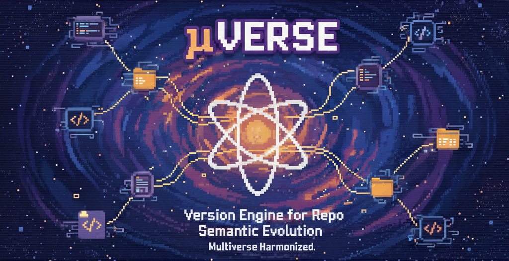

# μVERSE - Version Engine for Repo Semantic Evolution

**μVERSE** orchestrates the multiverse of your monorepo, where each module exists as an independent universe with its own semantic evolution timeline. Like cosmic events rippling through space-time, changes in one module intelligently cascade through dependency relationships, ensuring your entire codebase multiverse remains harmoniously synchronized.

μVERSE is a powerful semantic versioning engine that harnesses Conventional Commits to automatically evolve versions across your project multiverse, maintaining perfect dimensional stability while allowing each module universe to grow at its own pace.

## Key Features

✅ **Conventional Commits Parsing** - Automatically determines version bumps based on commit messages  
✅ **Multi-Module Support** - Each module can be versioned independently  
✅ **Dependency Cascade** - When a dependency changes, dependents are automatically bumped  
✅ **Gradle Adapter** - First-class support for Gradle (Groovy & Kotlin DSL)  
✅ **Extensible Architecture** - Easy to add adapters for other ecosystems  
✅ **Changelog Generation** - Automatic per-module changelog generation (to be added)
✅ **Pre-release Support** - Generate alpha, beta, rc, or custom pre-release versions  
✅ **Multiple Interfaces** - Use as a library, CLI tool, or GitHub Action

## 📦 Packages

μVERSE is organized as a monorepo with three main packages:

### [@muverse/core](packages/core) - Core Library
The core business logic powering μVERSE - completely independent of any framework or CI/CD system.

**Key Features:**
- Semantic version calculation and management
- Multi-module project support with dependency cascade detection
- Conventional commits parsing
- Changelog generation
- Git operations (commits, tags, pushes)
- Extensible adapter system (Gradle, etc.)
- Configuration loading and validation

**Use when:** You need semantic versioning in your own tools or applications.

### [@muverse/cli](packages/cli) - Command-Line Interface
CLI tool for μVERSE using oclif, perfect for local development and custom CI/CD systems.

**Key Features:**
- `muverse version` command for calculating and applying version updates
- Full configuration support via flags
- Human-friendly output
- All core features available through the command line

**Use when:** You want to use μVERSE locally or in non-GitHub CI/CD systems.

### [@muverse/action](packages/action) - GitHub Action
GitHub Actions wrapper providing seamless integration with GitHub workflows.

**Key Features:**
- GitHub Actions integration
- Automatic action inputs/outputs
- GitHub-specific functionality
- Automatic deployment to GitHub Actions Marketplace

**Use when:** You want to run μVERSE as a GitHub Action in your workflows.

## Getting Started

Choose the μVERSE package that best fits your needs:

- **For GitHub workflows:** See [@muverse/action](packages/action) - GitHub Actions integration
- **For local development or custom CI/CD:** See [@muverse/cli](packages/cli) - Command-line interface
- **For library integration:** See [@muverse/core](packages/core) - Core library for custom tools

### Quick Setup

```bash
# Install all packages
npm install

# Build everything
npm run build

# Run tests
npm test
```

For specific package setup, see individual package READMEs.

## Commit Message Format

μVERSE uses [Conventional Commits](https://conventionalcommits.org/) to automatically determine version bumps:

```
<type>[optional scope]: <description>

[optional body]

[optional footer(s)]
```

**Examples:**
- `feat(api): add new endpoint` → **minor** bump
- `fix(core): resolve memory leak` → **patch** bump  
- `feat!: breaking API change` → **major** bump

## Architecture

μVERSE follows a layered architecture:

- **`core`** - Business logic layer with no framework dependencies
  - `adapters/` - Language-specific adapters (Gradle, extensible)
  - `services/` - Core services (versioning, modules, changelog, git)
  - `factories/` - Factory pattern for adapter and module system creation
  - `config/` - Configuration loading and validation
  - `git/` - Git operations and commit parsing
  - `semver/` - Semantic versioning utilities
  - `changelog/` - Changelog generation
  - `utils/` - Shared utilities

- **`cli`** - oclif-based command-line interface
  - Wraps core functionality with CLI commands and flags
  
- **`action`** - GitHub Actions integration
  - Wraps core functionality with GitHub Actions inputs/outputs

## Extending

To add support for new project types, see the [core package documentation](packages/core#creating-custom-adapters) for instructions on implementing custom adapters.

## Development

### Setup

```bash
npm install
npm run build
npm test
```

### Monorepo Structure

```
packages/
├── core/               # Core library
│   └── src/
│       ├── adapters/          # Language adapters
│       ├── services/          # Core services
│       ├── config/            # Configuration
│       └── ...
├── cli/                # CLI tool
│   └── src/
└── action/             # GitHub Action
    └── src/
```

For detailed development information, see individual package READMEs.

## License

MIT License - see [LICENSE](LICENSE) for details.